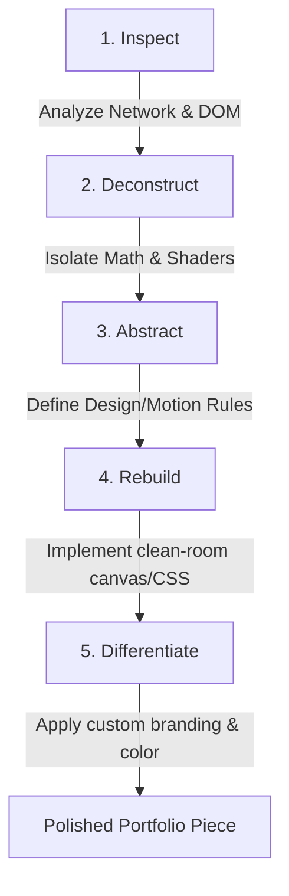

# Technical Deconstruction Methodology

This document outlines the systematic, clean-room deconstruction methodology employed in this project. This approach allows developers to study premium web designs and replicate their technical principles ethically.

---

## The Workflow

### 1. Inspect
Using automated headless tooling (e.g., our Playwright-based `scrape-site-assets.js` script) and browser Developer Tools to audit the target page:
* Inspect HTML/CSS classes (e.g., detecting if custom scroll hooks like Locomotive Scroll are active).
* Monitor network logs to categorize scripts, styles, textures, fonts, and assets.
* Identify Canvas/WebGL elements and evaluate their scale and placement.

### 2. Deconstruct
Investigate how specific components or animations function at a high level:
* Identify render loops, render libraries (e.g., Three.js, PixiJS, or Vanilla 2D context), or custom physics.
* Identify page triggers (e.g., mouse coordinates, scroll positions, or custom timers).
* Review minified files strictly as a black box to map asset loading pathways without copying code lines.

### 3. Abstract
Translate findings into high-level mathematical or architectural rules:
* Represent animations as vector formulas, sine waves, particle velocity vectors, or noise coordinates (e.g., Perlin/Simplex noise).
* Capture timing and duration principles: Is the animation linear? Exponential? What is the easing function?
* Document these findings in an isolated markdown spec (`docs/demos/...`) before writing any lines of implementation code.

### 4. Rebuild
Construct a clean-room implementation from scratch inside the target project:
* Write clean, idiomatic React/TypeScript/Tailwind components.
* Build canvas scripts or CSS animation loops using standard browser Web APIs.
* Keep structural dependencies minimal to ensure maximum performance and high CWV (Core Web Vitals) metrics.

### 5. Differentiate
Transform the rebuilt structure to establish a completely distinct identity:
* **Branding & Copywriting:** Define a fictional, neutral product space with original messaging.
* **Color System:** Swap out reference colors for a custom-curated palette (e.g., changing warm golden gradients to high-tech violet/teal).
* **Composition & Layout:** Rearrange the grid proportions, card flows, and typography systems to prevent structural parity.
* **Motion Tuning:** Alter the speed, particle density, wave frequencies, and user-interaction triggers to build a uniquely tuned experience.
